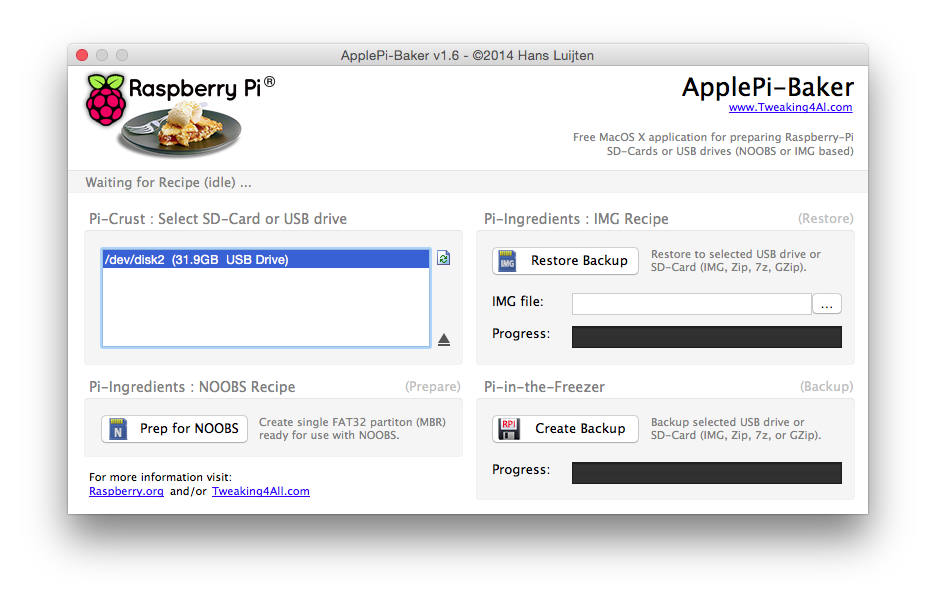
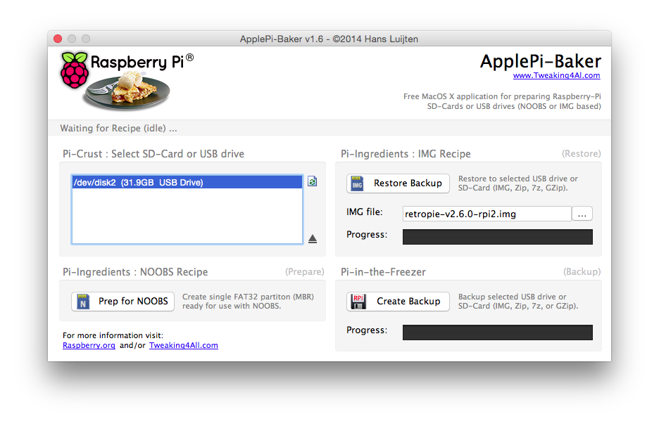
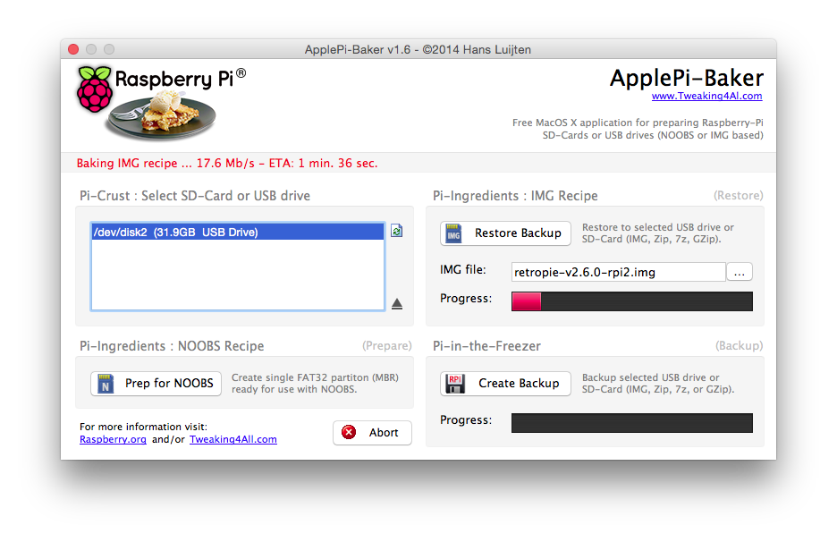
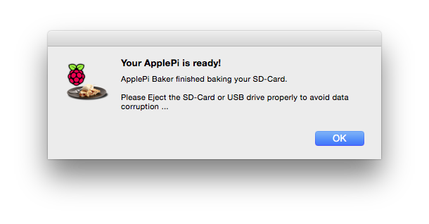
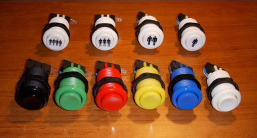
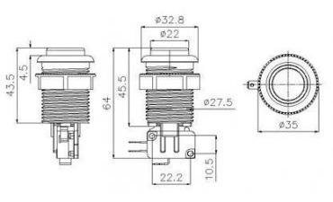
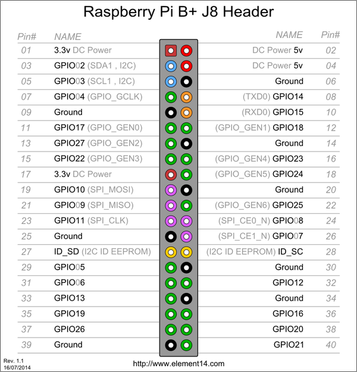
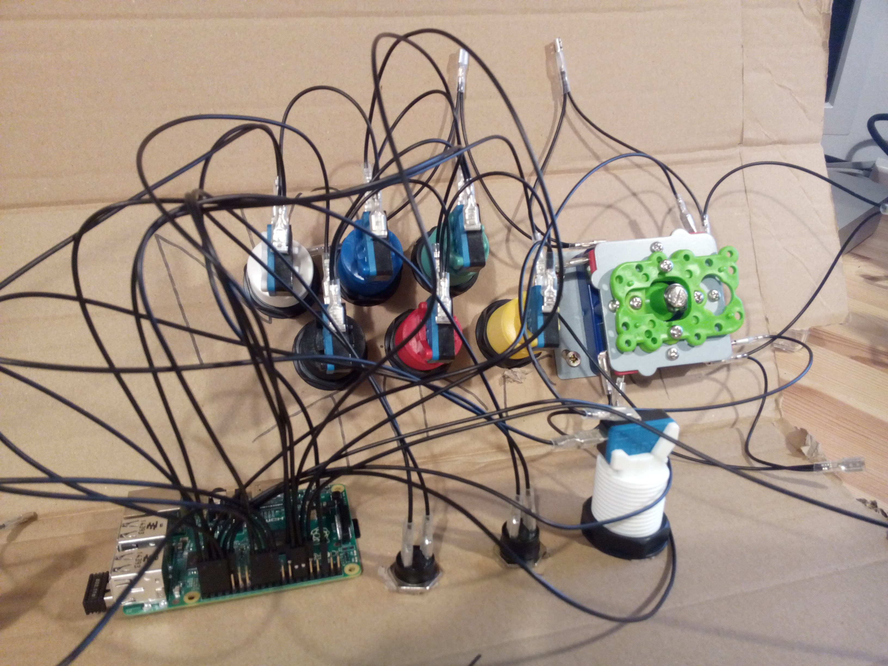
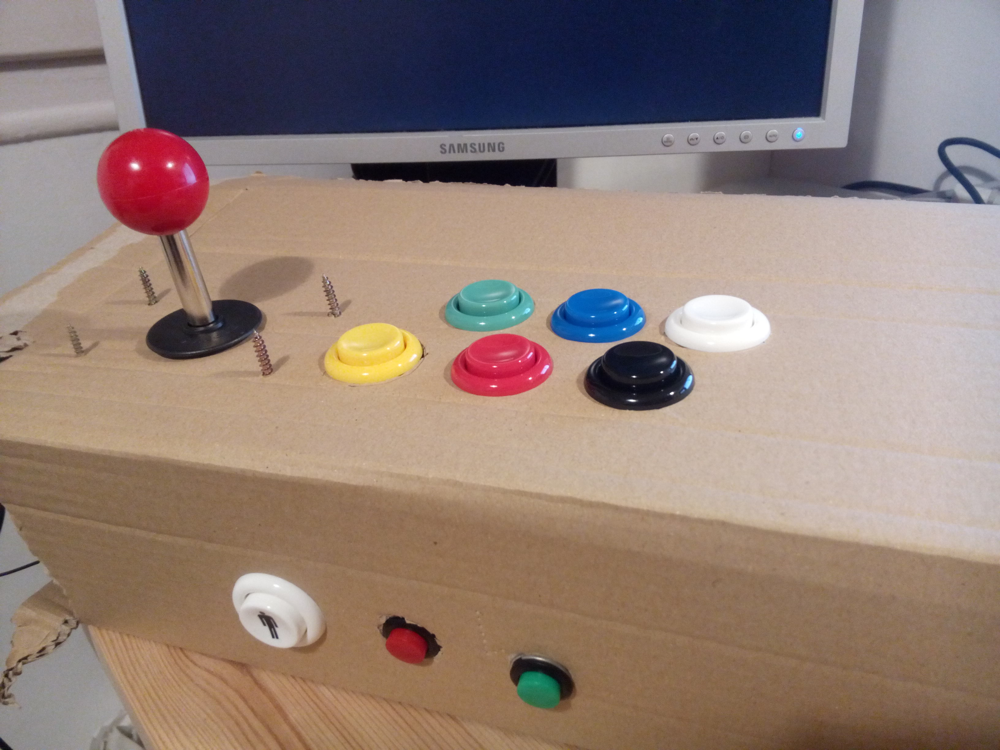

# Murtop - Raspberry Pi Bartop Arcade Machine Project

> Work in progress

* [Checklist](#checklist)
* [Tool, materials and hardware](#tools-materials-and-hardware)
	* [Internals](#internals)
	* [Display](#display)
	* [Controls](#controls)
	* [Cabinet](#cabinet)
	* [Woodworking tools](#woodworking-tools)
* [Installing RetroPie](#installing-retropie)
* [Flashing the SD card](#flashing-the-sd-card)
* [Setting up RetroPie](#setting-up-retropie)
	* [Expanding the Filesystem](#expanding-the-filesystem)
	* [Setting up language and input](#setting-up-language-and-input)
	* [Configuring the Raspberry Pi Wi-Fi](#configuring-the-raspberry-pi-wi-fi)
* [Customizing RetroPie](#customizing-retropie)
	* [Installing Pixel theme](#installing-pixel-theme)
		* [Replacing the RetroPie splash screen](#replacing-the-retropie-splash-screen)
		* [Replacing the RetroPie Settings icons](#replacing-the-retropie-settings-icons)
		* [Replacing Runcommand System Splash Screens](#replacing-runcommand-system-splash-screens)
* [Accessing the Raspberry Pi via SSH](#accessing-the-raspberry-pi-via-ssh)
	* [Using the Terminal](#using-the-terminal)
	* [Using Cyberduck (or any other FTP client)](#using-cyberduck-or-any-other-ftp-client)
* [Joysticks and buttons](#joysticks-and-buttons) 
	* [American push buttons](#american-push-buttons) 
	* [Wiring](#wiring)
* [Setting up the arcade buttons](#setting-up-the-arcade-buttons)
* [Configuring a USB controller](#configuring-a-usb-controller)
	* [SNES controller](#snes-controller)
	* [Xbox 360 controller](#xbox-360-controller)
	* [PlayStation 3 controller](#playstation-3-controller)
* [Configuring an 8Bitdo gamepad](#configuring-an-8Bitdo-gamepad)
* [Emulators and ROMs](#emulators-and-roms)
* [Installing GameMaker games](#installing-gamemaker-games)
* [Configure Retroarch](#configure-retroarch)
* [Troubleshooting](#troubleshooting)
* [Credits](#credits)
	* [Projects](#projects) 
	* [Tutorials](#tutorials)
	* [People](#people)
	* [Shops](#shops)

## Checklist

* 1 player GPIO arcade buttons &#x2713;
* 1 player USB controller &#x2713;
* 2 players GPIO arcade buttons &#x2713;
* 2 players USB controller &#x2717;

## Tools, materials and hardware

*If there's no price it means that I didn't buy the item because I already had it.*

### Internals

* [Raspberry Pi 2 Model B  - Complete Starter kit](http://www.amazon.es/dp/B00STW2Y6E/ref=pe_386191_41384461_TE_item) - **65,99€**
	* Raspberry Pi 2 Model B (1GB)
	* Enclousure Case (Clear)
	* Set of 2 Heat Sink
	* Micro USB EU Power Supply (2000 mA)
	* HDMI Cable
	* 8GB SD card
	* Wi-Fi adapter (801.11n)
* [Assembled Pi Cobbler Plus - Breakout Cable](http://www.amazon.es/gp/product/B00OKZIYOU?psc=1&redirect=true&ref_=oh_aui_detailpage_o02_s00) - **9,9€**

### Display

* 20" LCD TFT monitor
* DVI cable
* [DVI-D (female) to HDMI (male) adapter](http://www.amazon.es/dp/B009YCASUW/ref=pe_386191_41384461_TE_item) - **8,61€**

### Controls

* [Joysticks and buttons kit](http://www.arcadeoutlet.es/en/35-crea-tu-kit-de-joysticks) - **37,95€**
* [Control panel wiring (4.8mm Fast-On connectors)](http://www.arcadeoutlet.es/es/cableado/49-cableado-panel-control-2015000009005.html#/medida_fast_on-conector_4_8mm) - **9,95€**
* [Classic SNES USB controler (x2)](http://www.ebay.es/itm/Classic-Super-Nintendo-USB-Famicom-Color-SNES-SF-Controller-for-Windows-PC-MAC-/291190277567?ssPageName=ADME:L:OC:ES:3160) - **7,3€**
* USB keyboard and mouse (at least for initial the configuration)

### Cabinet

* 16mm MDF - **25€**
* Pine lath 20x20mm - **4,65€**
* Brass piano hinge (x2) - **3,9€**
* Magnetic closure (x4) - **2,4€**
* Acrylic primer - **6,1€**
* Acrylic matte black paint - **7,5€**
* Wood glue - **7,95€**
* [16mm U-Molding 3m](http://www.arcadeoutlet.es/es/u-molding/152-u-molding-negro-2082000004002.html#) - **10,5€**
* [19mm U-Molding 1m](http://www.arcadeoutlet.es/es/u-molding/152-u-molding-negro-2082000004002.html#) - **3,5€**

### Marquee

* [DIODER](http://ca.ikea.com/es/ca/catalog/products/40192361/) (IKEA Multicolor LED Stripes) - **29,99€**
* [USB mini stereo speakers](http://www.amazon.es/gp/product/B006L3ZUI2?psc=1&redirect=true&ref_=oh_aui_detailpage_o03_s00) - **6,1€**

### Woodworking tools

* Screwdriver
* Drill with ~28mm, ~12mm, and ~2mm bits
* Clamps
* Jigsaw
* Sandpaper
* Wood rasp
* Paint roller and small brush

### Total

* **243,79€**

*Take into account that we are building two cabinets at the same time so some materials are split and the prices might not be accurate.*

## Installing RetroPie

*You can also follow the official Retropie Wiki [First installation](https://github.com/retropie/retropie-setup/wiki/First-Installation) guide.*

* Download [RetroPie](https://retropie.org.uk/download/).
* Extract the downloaded compressed (`.gz`) file. The extracted file will be an image (`.img`) file.
* Flash the image into an SD card using [ApplePi-Baker](http://www.tweaking4all.com/hardware/raspberry-pi/macosx-apple-pi-baker/) or [RPi-sd card builder](https://alltheware.wordpress.com/2012/12/11/easiest-way-sd-card-setup/).
* [More info](http://elinux.org/RPi_Easy_SD_Card_Setup#Flashing_the_SD_card_using_Mac_OS_X) about flashing sd cards on OSX.

## Flashing the SD card

We will be using [ApplePi-Baker](http://www.tweaking4all.com/hardware/raspberry-pi/macosx-apple-pi-baker/).

> Using another app like this one should be pretty similar to use.

* Select the SD card. 
* Select the image (`.img`) file you just downloaded. 
* Restore backup. 
* Finished! :D 
* Safely eject the SD card using the **Utility Disks** app.

## Setting up RetroPie

* Insert the recently flashed SD card into the Raspberry Pi and power it up.
* It will boot up directly into [EmulationStation](http://www.emulationstation.org/) (the graphical front-end emulator).
* It will ask you to configure the input (keyboard, joystick, controller, etc.) to navigate the menus. Use the keyboard for now.
* But, **before proceeding any further**, let's back up a little and configure the Wi-Fi and other settings.

*All the configurations below can be done in a more user-friendly way via the Retropie Settings Menu in EmulationStation (e.g. Configuring the Wi-Fi).*

### Expanding the Filesystem

I think the latest versions of RetroPie just expand the Filesystem automatically right after you boot the Raspberry Pi for the first time, but just in case it doesn't do it, here's a manual method:

* Boot the Raspberry Pi.
* Quit EmulationStation. It will take you to the command line.
* Type:

```
sudo raspi-config
```

* It will open a basic GUI. 
* Select **1 Expand Filesystem**. This will make all the SD card storage available for usage.

### Setting up language and input

* Still in the `raspi-config` screen, select **4 Internationalisation Options**.
* Here you can change your locale, timezone and keyboard input.
* When you're done, select **Finish** and **reboot**.

### Configuring the Raspberry Pi Wi-Fi

> If you have a Raspberry Pi 3, good for you! Because you won't need a Wi-Fi adapter ;)

The latest versions of RetroPie have a built-in Wi-Fi configurator.

* In EmulationStation, go to `RetroPie Settings > Wi-Fi`.
* Choose `Connect to Wi-Fi network`.
* Select the network you would like to connect to and enter the password.

If this method doesn't work, here's a manual method that should work.

* Boot the Raspberry Pi with the Wi-Fi adapter plugged in (or not, if you are a proud owner of a Raspberry Pi 3!).
* Quit EmulationStation. It will take you to the command line.
* Type:

```
sudo nano /etc/network/interfaces
```

* Modify the file so it looks like this one:

```
auto lo
 
iface lo inet loopback
iface eth0 inet dhcp


auto wlan0
allow-hotplug wlan0
iface wlan0 inet dhcp
        wpa-ssid "ssid"
        wpa-psk "password"
```

* When you're finished, press `ctrl + X` *(exit)*. It will ask you if you want to save the modified file. Type `Y` *(yes)* and then press `return` to save the file with the same name.
* Now type:

```
sudo reboot
```

* This will reboot the Raspberry Pi.
* To check if the Wi-Fi is working, in EmulationStation, go to `Retropie Settings > Show IP`.
* If this doesn't work, go to the command line again and type:

```
sudo ip addr show
```

* And under `wlan0` you'll find your IP.
* Or just type:

```
hostname -I
```

* It does the same thing ;)

## Customizing RetroPie

### Installing Pixel theme

> For me, the best theme there is! :D Thanks and congratulations to [Rookervik](https://retropie.org.uk/forum/topic/768/pixel-theme).

* Go to the `Retropie Settings` in EmulationStation.
* Go to `ES Themes`.
* Install `Pixel theme`.
* In EmulationStation, go to `Main Menu > UI Settings > Theme Set` and choose `Pixel`.

#### Replacing the RetroPie splash screen

* Go to the `Retropie Settings` in EmulationStation.
* Go to `Splash Screens`.
* Choose `Download RetroPie-Extra splashscresns`.
* Go to `Choose splashscreen` and then `Own/extra splashscreens`.
* Scroll down until you see `retropie-extra/rookervik-pixel/pixel.png` (for 16:9 screens) or `retropie-extra/rookervik-pixel/pixel-4x3.png` (for 4:3 screens).
* Choose one.
* Reboot the see the new splash screen.

**Update!**

To get the latest splash screens for the Pixel theme:

* Download the splash screens ([for 16:9 screens](https://raw.githubusercontent.com/RetroPie/es-theme-pixel/master/splash16-9.png) and [for 4:3 screens](https://raw.githubusercontent.com/RetroPie/es-theme-pixel/master/splash4-3.png)) directly from GitHub.
* Access the Raspberry Pi by [Using Cyberduck (or any other FTP client)](#using-cyberduck-or-any-other-ftp-client).
* Go to `/home/pi/RetroPie/splashscreens/` and copy them here.
* It would be a good idea to rename them, by adding a prefix like `pixel-`, to avoid confusions with other splash screens you may have here in the future.
* Follow the steps above this update and when you are at `Own/extra splashscreens` you'll see the two splash screens that we just copied.
* Choose one.
* Reboot the see the new splash screen.

#### Replacing the RetroPie Settings icons

*These icons are designed to be used along with the Pixel theme.*

When you install the Pixel theme, you can see right away how the icons in the Retropie Settings doesn't fit at all with the rest of the theme. Luckily, the Pixel theme comes with its own set of pixelated icons for the Retropie Settings. Let's change them!

* Quit EmulationStation.
	* When in EmulationStation, go to `Main Menu > Quit > Quit EmulationStation`.
	* You'll be taken to the command line.
* [Access the Raspberry Pi via SSH](#access-the-raspberry-pi-via-ssh) or by [Using Cyberduck (or any other FTP client)](#using-cyberduck-or-any-other-ftp-client).
* Go to `/opt/retropie/configs/all/emulationstation/gamelists/retropie/gamelist.xml` and edit it.
* Change all the `<image>` tags paths (e.g. `<image>./icons/esthemes.png</image>`) from `./icons/` to `/etc/emulationstation/themes/pixel/retropie/icons/`.
* Restart EmulationStation from the command line by typing `emulationstation` and hitting `enter`.
* Enjoy your *now-matching* Retropie Settings icons!

### Replacing Runcommand System splash screens

*These splash screens are designed to be used along with the Pixel theme.*

* [Download](https://github.com/ehettervik/es-runcommand-splash/archive/master.zip) the splash screens.
* Unzip `launching.zip`. You'll see folders for each emulator.
* Inside each folder there's a `launching.png` file. You have to place them in `opt/retropie/configs/` inside the emulator folder you want the splash screen to be shown.
* There are a couple of exceptions:
	* Megadrive and Genesis share the same folder so you'll have to choose which one to use. If you choose the `launching-megadrive.png` remember to rename it to `launching.png` before placing it in `opt/retropie/configs/`
	* Same for the SNES.
* Go the `Retropie Settings` in EmulationStation and choose `Retropie Setup`.
* This will take you to the configuration GUI.
* Select `Configuration / tools`.
* Select `runcommand - The 'runcommand' launch script ...`.
* **Enable** `Launch menu`.
* **Disable** `Launch menu art`.
* Restart EmulationStation.

## Adding a retro style to the games

### Pixelating the games

Let's give the games a more retro style, kind of the look as if you were playing on an old CRT.
We'll deactivate the video smoothness and we'll add some scanlines.

#### Non Libretro emulators

`mame4all` and `pifba` (which are the best MAME emulators for Raspberry Pi 0/1) are not libretro/Retroarch emulators, so you'll have to configure them separately.

##### Mame4all

* Edit `/opt/retropie/configs/mame-mame4all/mame.cfg`.
* Go to the bottom of the `[config]` section.
* Change `display_smooth_stretch=yes` to `display_smooth_stretch=no` to deactivate the smoothness of the image.
* Change `display_effect=0` to `display_effect=1` to activate scanlines.

##### PiFBA

* Edit `/opt/retropie/configs/fba/fba2x.cfg`.
* Go to the bottom of the file, where `[Graphics]`  section starts.
* Change `DisplaySmoothStretch=1` to `DisplaySmoothStretch=0` to deactivate the smoothness of the image.
* Change `DisplayEffect=0` to `DisplayEffect=1` to activate scanlines.

#### Libretro emulators

* Go the `Retropie Settings` in EmulationStation and choose `Configuration editor`.
* Choose `Configure basic libretro emulator options`, then choose a specific emulator or `Configure default options for all libretro emulators` to make the change system-wide.
* Then, set `Video Shader Enable` to `true` and then set `Video Shader File` to the desired shader (`crt-pi.glslp` and `crt-pi-curvature.glslp` are recommended).

Video smoothing for Libretro emulator is off by default.

## Accessing the Raspberry Pi via SSH

### Using the Terminal

* Open a Terminal session on your computer and type:

```
ssh pi@your.raspberrypi.ip.address
```

* It will ask you to add this address to a list of known hosts. Type `yes` and press `return`.
* It will ask you for the Raspberry Pi **password**, which by default is **raspberry**.

### Using Cyberduck (or any other FTP client)

* Open [Cyberduck](https://cyberduck.io/), click **New connection**.
* Select **SFTP (SSH File Transfer Protocol)**.
* Enter the Raspberry Pi IP address in **Server**.
* Leave the port at 22.
* Enter your username (**pi** by default) and password (**raspberry** by default).
* Click **Connect**.

## Building the cabinet


## Joysticks and buttons

### American push buttons





*Images from [Arcade Outlet](http://www.arcadeoutlet.es/es/botones/11-boton-americano-28mm-2020000001003.html).*

### Wiring

With the Raspberry Pi B+ and Raspberry Pi 2 B+ you can use up to 26 GPIO, perfect for a 2 player bartop, including:

* 2 joysticks (8 buttons)
* 12 action buttons
* 2 players buttons
* 2 service buttons
* 2 pinball buttons (which we won't be using)



### 

*Image from [element14](http://www.element14.com/).*





*My humble scaffold for the controller.*

## Setting up the arcade buttons

Download [Adafruit's retrogame](https://github.com/adafruit/Adafruit-Retrogame), a Raspberry Pi GPIO-to-USB utility for classic game emulators.

* Boot the Raspberry Pi.
* Quit EmulationStation. It will take you to the command line.
* Unzip `Adafruit-Retrogame-master.zip`.
* Rename `Adafruit-Retrogame-master` folder to `Adafruit-Retrogame`.
* Connect to your Raspberry Pi [using CyberDuck](#using-cyberduck).
* Copy the `Adafruit-Retrogame` folder into `/home/pi/` on your Raspberry Pi. 
* Open a [Terminal session](#using-the-terminal) and type:

```
cd Adafruit-Retrogame
nano retrogame.c
```

* Scroll down until you see:

```
ioStandard[] = {
    // This pin/key table is used when the PiTFT isn't found
    // (using HDMI or composite instead), as with our original
    // retro gaming guide.
    // Input   Output (from /usr/include/linux/input.h)
    {  25,     KEY_LEFT     },   // Joystick (4 pins)
    {   9,     KEY_RIGHT    },
    {  10,     KEY_UP       },
    {  17,     KEY_DOWN     },
    {  23,     KEY_LEFTCTRL },   // A/Fire/jump/primary
    {   7,     KEY_LEFTALT  },   // B/Bomb/secondary
    // For credit/start/etc., use USB keyboard or add more buttons.
    {  -1,     -1           } }; // END OF LIST, DO NOT CHANGE
```

* Change it to fit.
* Here it is our 2 players set up:

```
ioStandard[] = {
    // This pin/key table is used when the PiTFT isn't found
    // (using HDMI or composite instead), as with our original
    // retro gaming guide.
    // Input   Output (from /usr/include/linux/input.h)
	//
	// PLAYER 1
    {   7,     KEY_LEFT     },
    {  20,     KEY_RIGHT    },
    {  21,     KEY_UP       },
    {  16,     KEY_DOWN     },
	{   8,	   KEY_A		}, // Green
	{  25,	   KEY_Z		}, // Yellow
	{  18,	   KEY_X		}, // Red
	{  15,	   KEY_S		}, // Blue
	{  14,	   KEY_W		}, // White
	{  26,	   KEY_Q		}, // Black
	{   3,	   KEY_xx		}, // 1 Player

	{  24,	   KEY_ENTER	},
	{  23,	   KEY_EXIT		},

	// PLAYER 2
    {  13,     KEY_LEFT     },
    {  20,     KEY_RIGHT    },
    {   6,     KEY_UP       },
    {  11,     KEY_DOWN     },
	{  10,	   KEY_A		}, // Green
	{   9,	   KEY_Z		}, // Yellow
	{  27,	   KEY_X		}, // Red
	{  22,	   KEY_S		}, // Blue
	{   4,	   KEY_W		}, // White
	{  17,	   KEY_Q		}, // Black
	{   2,	   KEY_xx		}, // 2 Players

    // For credit/start/etc., use USB keyboard or add more buttons.
    {  -1,     -1           } }; // END OF LIST, DO NOT CHANGE
```

* When you're finished, press `ctrl + X` *(exit)*. It will ask you if you want to save the modified file. Type `Y` *(yes)* and then press `return` to save the file with the same name.
* Now type:

```
make retrogame
```

* Then:

```
sudo nano /etc/udev/rules.d/10-retrogame.rules
```

* And copy & paste:

```
SUBSYSTEM=="input", ATTRS{name}=="retrogame", ENV{ID_INPUT_KEYBOARD}="1"
```

* When you're finished, press `ctrl + X` *(exit)*. It will ask you if you want to save the modified file. Type `Y` *(yes)* and then press `return` to save the file with the same name.
* Let's see if it works. Type:

```
sudo ./retrogame
```

* If you don't get any error, it's working! Yay! Press `ctrl + c` to stop the program.
* To set it up to **launch at startup**, type:

```
sudo nano /etc/rc.local
``` 

* Before the final `exit 0` line, insert this line:

```
/home/pi/Adafruit-Retrogame/retrogame &
```

* When you're finished, press `ctrl + X` *(exit)*. It will ask you if you want to save the modified file. Type `Y` *(yes)* and then press `return` to save the file with the same name.
* Now type:

```
sudo reboot
```

* This will reboot the Raspberry Pi.

## Configuring a USB controller

Just go to the Retropie Wiki page [Controller Configuration (RetroArch)](https://github.com/retropie/retropie-setup/wiki/RetroArch-Configuration).

### SNES controller


### Xbox 360 controller


### PlayStation 3 controller


*Images from [RetroPie Wiki](https://github.com/petrockblog/RetroPie-Setup/wiki/RetroArch-Configuration).*

## Configuring an 8Bitdo gamepad

Again, just go to the Retropie Wiki page [Setting up an 8bitdo Bluetooth controller](https://github.com/retropie/retropie-setup/wiki/Setting-up-an-8bitdo-Bluetooth-controller).

When you're finished setting up the 8Bitdo gamepad, go to `/opt/retropie/configs/all/retroarch-joypads/`. Here you should see a file  called something like `8BitdoNES30GamePad.cfg` (in this case it's an 8Bitdo's NES30 gamepad configuration file) and it should look like this:

```
input_device = "8Bitdo NES30 GamePad"
input_driver = "udev"
input_l_btn = "6"
input_load_state_btn = "6"
input_start_btn = "11"
input_exit_emulator_btn = "11"
input_up_axis = "-1"
input_a_btn = "0"
input_b_btn = "1"
input_reset_btn = "1"
input_down_axis = "+1"
input_r_btn = "7"
input_save_state_btn = "7"
input_right_axis = "+0"
input_state_slot_increase_axis = "+0"
input_x_btn = "3"
input_menu_toggle_btn = "3"
input_select_btn = "10"
input_enable_hotkey_btn = "10"
input_y_btn = "4"
input_left_axis = "-0"
input_state_slot_decrease_axis = "-0"
```

You can find more examples in the link above.

### 8Bitdo's gamepads troubleshooting

If, for some reason, after configuring the gamepad in EmulationStation it doesn't seem to work when you're in a game, try:

* Update RetroPie to the latest version.
	* In the `RetroPie-Setup script` go to `Update RetroPie-Setup script`.
	* Then, still in the `RetroPie-Setup script`, go to `Update all installed packages`.
* Update the [gamepad's firmware](http://www.8bitdo.com/Support.html).
* Redo the bluetooth setup.
	* `Remove bluetooth device`.
	* `Register and connect again`.
* Redo configuration un EmulationStation.

*Thanks to [Rion (in the Retropie forum)](https://retropie.org.uk/forum/topic/5569/nes-snes-and-8bitdo/6)*.
 
## Emulators and ROMs

* Connect to your Raspberry Pi [using CyberDuck](#using-cyberduck).
* Go to `/home/pi/RetroPie/roms/`
* Look for the emulator's folder corresponding to your ROM and copy it there.
* Now type:

```
sudo reboot
```

* This will reboot the Raspberry Pi.

## Installing GameMaker games

[YoYo Games](http://www.yoyogames.com/), the people behind [GameMaker](http://www.yoyogames.com/gamemaker) (a platform to develop video games), have been kind enough to port three indie games for the Raspberry Pi.

So, let's begin!

* [Download](http://www.yoyogames.com/pi) the games from their website.
* Unzip them.
* Copy the folder of each game into `/home/pi/RetroPie/roms/ports/`.
* [Download](https://github.com/bite-your-idols/gamemaker-retropie/archive/master.zip) the `.sh` files needed to run the games.
* Unzip the folder and copy the `.sh` into the same folder `/home/pi/RetroPie/roms/ports/`.
* Change the `read` and `execute` permission of the `.sh` files.
* Restar EmulationStation.

The GameMaker games will appear on the `ports` section.

*One major caveat is that these ports only seem to work when using a gamepad.*

## Configure Retroarch


## Troubleshooting

* [Sound issues](https://github.com/retropie/retropie-setup/wiki/sound-issues).

## Credits

Thanks a lot to the following:

### Projects

* [RetroPie Wiki](https://github.com/retropie/retropie-setup/wiki)
* [3D Warehouse](https://3dwarehouse.sketchup.com/model.html?id=f94c70d445afb53a8c759df0d812057b)
* [GameMaker games for the Raspberry Pi](http://www.yoyogames.com/pi) and [GameMaker for Retropie](https://github.com/bite-your-idols/gamemaker-retropie)

### Tutorials

Above all, thanks a lot to the [Retropie Forum](https://retropie.org.uk/forum).

* [Adafruit's retrogame](https://github.com/adafruit/Adafruit-Retrogame) - Raspberry Pi GPIO-to-virtual-keyboard utility for classic game emulators.
* [2-Player Bartop Arcade Machine (Powered by Pi)](http://www.instructables.com/id/2-Player-Bartop-Arcade-Machine-Powered-by-Pi/?ALLSTEPS)
* [Zona Arcade Forums](http://zonaarcade.forumcommunity.net/)

### People

* [Floob](https://www.youtube.com/watch?v=OBloKEbBRAU)
* [Rookervik](https://retropie.org.uk/forum/topic/768/pixel-theme) - For creating the amazing Pixel theme for RetroPie.

### Shops

* [Arcade Outlet](http://www.arcadeoutlet.es/) - Spanish webstore to buy anything arcade related.
