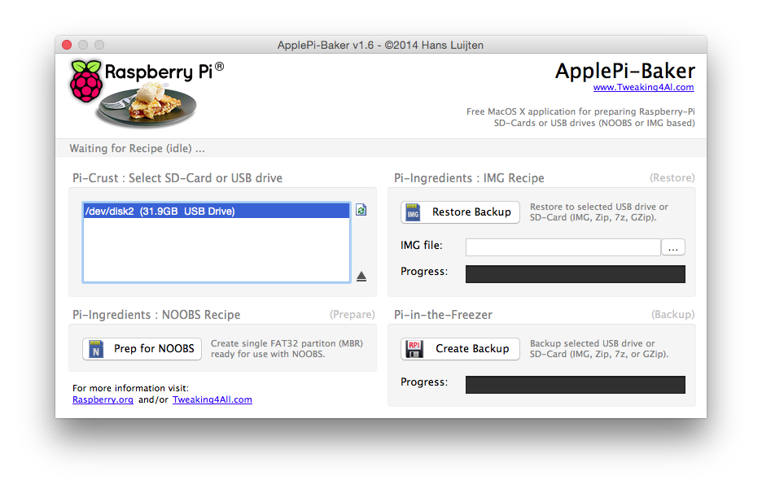
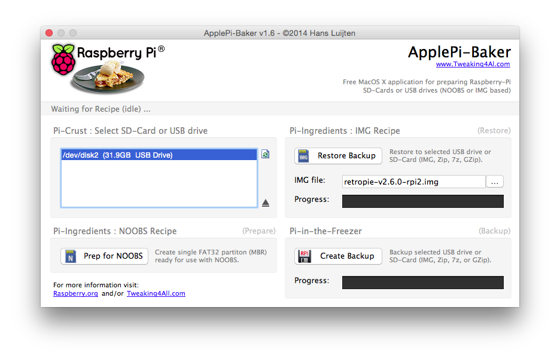
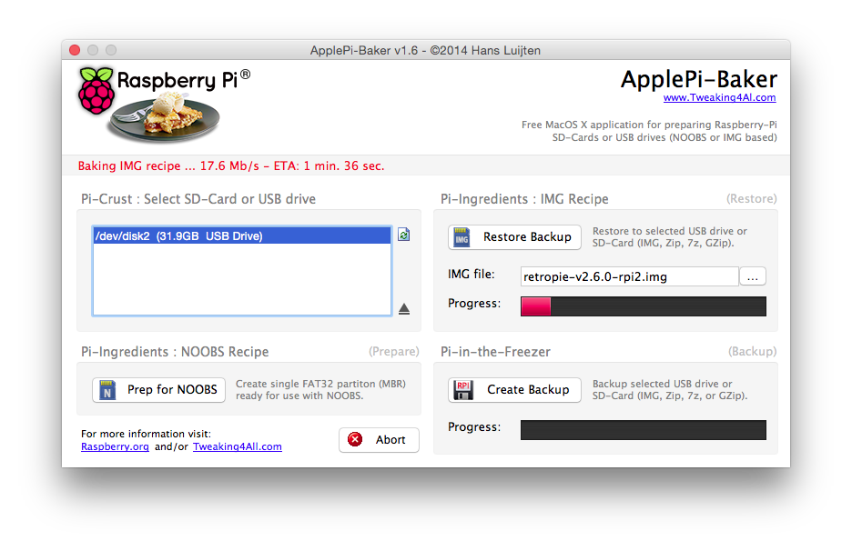
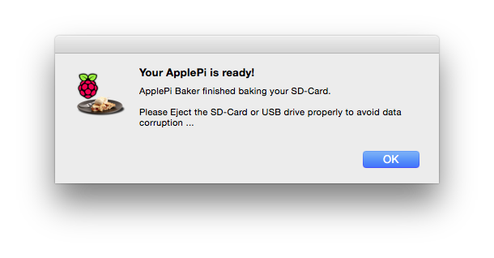
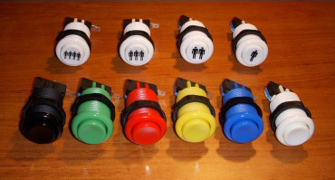
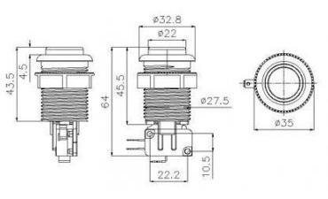
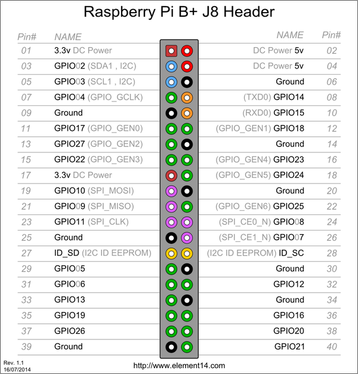
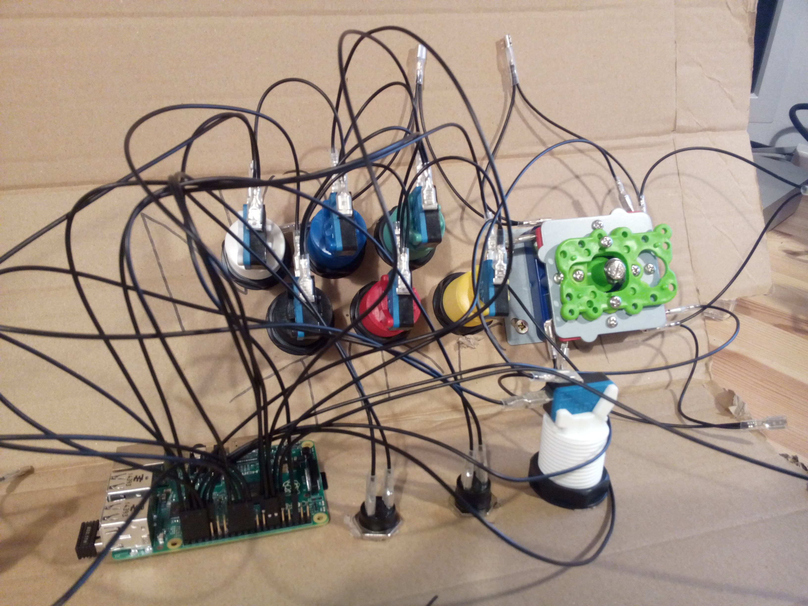
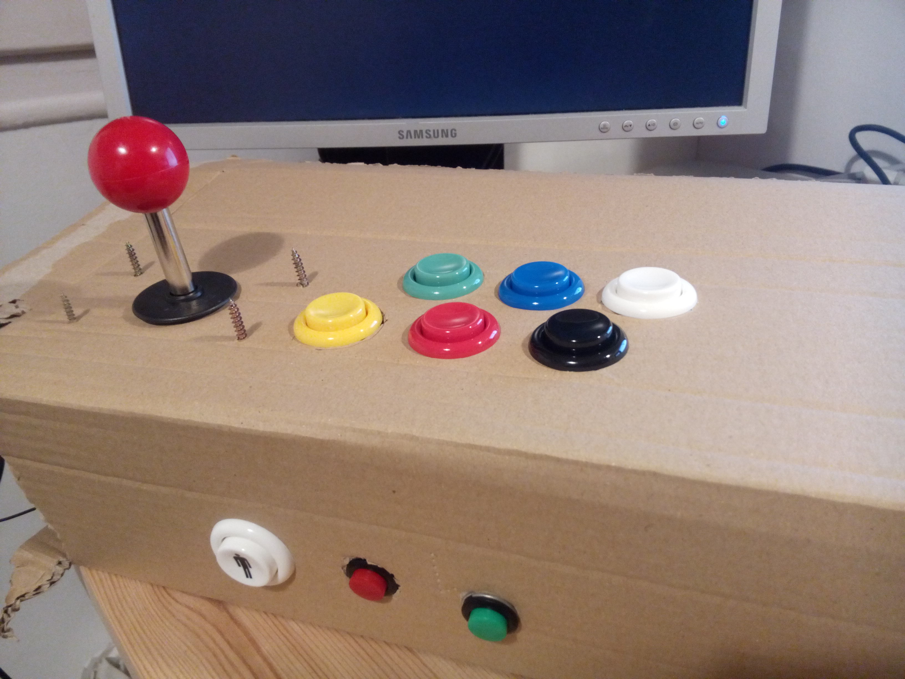

# Raspberry Pi Bartop Arcade Machine Project

> Work in progress

* [Checklist](#checklist)
* [Tool, materials and hardware](#tools-materials-and-hardware)
	* [Internals](#internals)
	* [Display](#display)
	* [Controls](#controls)
	* [Cabinet](#cabinet)
	* [Woodworking tools](#woodworking-tools)
* [Installing RetroPie](#installing-retropie)
* [Flashing the SD card](#flashing-the-sd-card)
* [Setting up RetroPie](#setting-up-retropie)
	* [Expanding the Filesystem](#expanding-the-filesystem)
	* [Setting up language and input](#setting-up-language-and-input)
	* [Configuring the Raspberry Pi Wi-Fi](#configuring-the-raspberry-pi-wi-fi)
* [Accessing the Raspberry Pi via SSH](#accessing-the-raspberry-pi-via-ssh)
	* [Using the Terminal](#using-the-terminal)
	* [Using Cyberduck (or any other FTP client)](#using-cyberduck-or-any-other-ftp-client)
* [Joysticks and buttons](#joysticks-and-buttons) 
	* [American push buttons](#american-push-buttons) 
	* [Wiring](#wiring)
* [Setting up the arcade buttons](#setting-up-the-arcade-buttons)
* [Configuring a USB controller](#configuring-a-usb-controller)
	* [SNES controller](#snes-controller)
	* [Xbox 360 controller](#xbox-360-controller)
	* [PlayStation 3 controller](#playstation-3-controller)
* [Emulators and ROMs](#emulators-and-roms)
* [Credits](#credits)
	* [Projects](#projects) 
	* [Tutorials](#tutorials)
	* [People](#people)
	* [Shops](#shops)

## Checklist

* 1 player GPIO arcade buttons &#x2713;
* 1 player USB controller &#x2713;
* 2 players GPIO arcade buttons &#x2713;
* 2 players USB controller &#x2717;

## Tools, materials and hardware

*If there's no price it means that I didn't buy the item because I already had it.*

### Internals

* [Raspberry Pi 2 Model B  - Complete Starter kit](http://www.amazon.es/dp/B00STW2Y6E/ref=pe_386191_41384461_TE_item) - **65,99€**
	* Raspberry Pi 2 Model B (1GB)
	* Enclousure Case (Clear)
	* Set of 2 Heat Sink
	* Micro USB EU Power Supply (2000 mA)
	* HDMI Cable
	* 8GB SD card
	* Wi-Fi adapter (801.11n)

### Display

* 20" LCD TFT monitor
* DVI cable
* [DVI-D (female) to HDMI (male) adapter](http://www.amazon.es/dp/B009YCASUW/ref=pe_386191_41384461_TE_item) - **8,61€**

### Controls

* [Joysticks and buttons kit](http://www.arcadeoutlet.es/en/35-crea-tu-kit-de-joysticks) - **37,95€**
* [Control panel wiring (4.8mm Fast-On connectors)](http://www.arcadeoutlet.es/es/cableado/49-cableado-panel-control-2015000009005.html#/medida_fast_on-conector_4_8mm) - **9,95€**
* [Classic SNES USB controler (x2)](http://www.ebay.es/itm/Classic-Super-Nintendo-USB-Famicom-Color-SNES-SF-Controller-for-Windows-PC-MAC-/291190277567?ssPageName=ADME:L:OC:ES:3160) - **7,3€**
* USB keyboard and mouse (at least for initial the configuration)

### Cabinet

* 16mm MDF - **25€**
* Pine lath 20x20mm - **4,65€**
* Brass piano hinge (x2) - **3,9€**
* Magnetic closure (x4) - **2,4€**
* Acrylic primer - **6,1€**
* Acrylic matte black paint - **7,5€**
* Wood glue - **7,95€**
* [16mm U-Molding 3m](http://www.arcadeoutlet.es/es/u-molding/152-u-molding-negro-2082000004002.html#) - **10,5€**

### Woodworking tools

* Screwdriver
* Drill with ~28mm, ~12mm, and ~2mm bits
* Clamps
* Jigsaw
* Sandpaper
* Wood rasp
* Paint roller and small brush

### Total

* **197,8€**

*Take into account that we are building two cabinets at the same time so some materials are split and the prices might not be accurate.*

## Installing RetroPie

* Download [RetroPie](http://blog.petrockblock.com/retropie/retropie-downloads/).
* Extract the downloaded compressed (`.gz`) file. The extracted file will be an image (`.img`) file.
* Flash the image into an SD card using [ApplePi-Baker](http://www.tweaking4all.com/hardware/raspberry-pi/macosx-apple-pi-baker/) or [RPi-sd card builder](https://alltheware.wordpress.com/2012/12/11/easiest-way-sd-card-setup/).
* [More info](http://elinux.org/RPi_Easy_SD_Card_Setup#Flashing_the_SD_card_using_Mac_OS_X) about flashing sd cards on OSX.

## Flashing the SD card

We will be using [ApplePi-Baker](http://www.tweaking4all.com/hardware/raspberry-pi/macosx-apple-pi-baker/).

> Using another app like this one should be pretty similar to use.

* Select the SD card. 
* Select the image (`.img`) file you just downloaded. 
* Restore backup. 
* Finished! :D 
* Safely eject the SD card using the **Utility Disks** app.

## Setting up RetroPie

* Insert the recently flashed SD card into the Raspberry Pi and power it up.
* It will boot up directly into [EmulationStation](http://www.emulationstation.org/) (the graphical front-end emulator).
* It will ask you to configure the input (keyboard, joystick, controller, etc.) to navigate the menus. Use the keyboard for now.
* But, **before proceeding any further**, let's back up a little and configure the Wi-Fi and other settings.

### Expanding the Filesystem

* Boot the Raspberry Pi.
* Quit Emulation Station. It will take you to the command line.
* Type:

```
sudo raspi-config
```

* It will open a basic GUI. 
* Select **1 Expand Filesystem**. This will make all the SD card storage available for usage.

### Setting up language and input

* Still in the `raspi-config` screen, select **4 Internationalisation Options**.
* Here you can change your locale, timezone and keyboard input.
* When you're done, select **Finish** and **reboot**.

### Configuring the Raspberry Pi Wi-Fi

* Boot the Raspberry Pi with the Wi-Fi adapter plugged in.
* Quit Emulaton Station. It will take you to the command line.
* Type:

```
sudo nano /etc/network/interfaces
```

* Modify the file so it looks like this one:

```
auto lo
 
iface lo inet loopback
iface eth0 inet dhcp


auto wlan0
allow-hotplug wlan0
iface wlan0 inet dhcp
        wpa-ssid "ssid"
        wpa-psk "password"
```

* When you're finished, press `ctrl + X` *(exit)*. It will ask you if you want to save the modified file. Type `Y` *(yes)* and then press `return` to save the file with the same name.
* Type:

```
sudo reboot
```

* This will reboot the Raspberry Pi.
* To check if the Wi-Fi is working, go to the command line again and type:

```
sudo ip addr show
```

* And under `wlan0` you'll find your IP.
* Or just type:

```
hostname -I
```

* It does the same thing ;)

## Accessing the Raspberry Pi via SSH

### Using the Terminal

* Open a Terminal session on your computer and type:

```
ssh pi@your.raspberrypi.ip.address
```

* It will ask you to add this address to a list of known hosts. Type `yes` and press `return`.
* It will ask you for the Raspberry Pi **password**, which by default is **raspberry**.

### Using Cyberduck (or any other FTP client)

* Open [Cyberduck](https://cyberduck.io/), click **New connection**.
* Select **SFTP (SSH File Transfer Protocol)**.
* Enter the Raspberry Pi IP address in **Server**.
* Leave the port at 22.
* Enter your username (**pi** by default) and password (**raspberry** by default).
* Click **Connect**.

## Joysticks and buttons

### American push buttons





*Images from [Arcade Outlet](http://www.arcadeoutlet.es/es/botones/11-boton-americano-28mm-2020000001003.html).*

### Wiring

With the Raspberry Pi B+ and Raspberry Pi 2 B+ you can use up to 26 GPIO, perfect for a 2 player bartop, including:

* 2 joysticks (8 buttons)
* 12 action buttons
* 2 players buttons
* 2 service buttons
* 2 pinball buttons.



### 

*Image from [element14](http://www.element14.com/).*





*My humble scaffold for the controller.*

## Setting up the arcade buttons

Download [Adafruit's retrogame](https://github.com/adafruit/Adafruit-Retrogame), a Raspberry Pi GPIO-to-USB utility for classic game emulators.

* Boot the Raspberry Pi.
* Quit Emulation Station. It will take you to the command line.
* Unzip `Adafruit-Retrogame.zip`.
* Connect to your Raspberry Pi [using CyberDuck](#using-cyberduck).
* Copy the `Adafruit-Retrogame` folder into `/home/pi/` on your Raspberry Pi. 
* Open a [Terminal session](#using-the-terminal) and type:

```
cd Adafruit-Retrogame
nano retrogame.c
```

* Scroll down until you see:

```
ioStandard[] = {
    // This pin/key table is used when the PiTFT isn't found
    // (using HDMI or composite instead), as with our original
    // retro gaming guide.
    // Input   Output (from /usr/include/linux/input.h)
    {  25,     KEY_LEFT     },   // Joystick (4 pins)
    {   9,     KEY_RIGHT    },
    {  10,     KEY_UP       },
    {  17,     KEY_DOWN     },
    {  23,     KEY_LEFTCTRL },   // A/Fire/jump/primary
    {   7,     KEY_LEFTALT  },   // B/Bomb/secondary
    // For credit/start/etc., use USB keyboard or add more buttons.
    {  -1,     -1           } }; // END OF LIST, DO NOT CHANGE
```

* Change it to fit.
* Now type:

```
make retrogame
```

* Then:

```
sudo nano /etc/udev/rules.d/10-retrogame.rules
```

* And copy:

```
SUBSYSTEM=="input", ATTRS{name}=="retrogame", ENV{ID_INPUT_KEYBOARD}="1"
```

* When you're finished, press `ctrl + x`. This will ask you if you want to save the modified file. Press `Y` and then press `return` to save the file with the same name.
* Let's see if it works. Type:

```
sudo ./retrogame
```

* If you don't get any error, it's working. Press `ctrl + c` to stop the program.
* To set it up to **launch at startup**, type:

```
sudo nano /etc/rc.local
``` 

* Before the final `exit 0` line, insert this line:

```
/home/pi/Adafruit-Retrogame/retrogame &
```

* When you're finished, press `ctrl + x`. This will ask you if you want to save the modified file. Press `Y` and then press `return` to save the file with the same name.
* Reboot the Raspberry Pi. Type:

```
sudo reboot
```

## Configuring a USB controller

> **TL;DR** Here's a [Youtube video](https://www.youtube.com/watch?v=OBloKEbBRAU) explaining how to configure the USB controller.

* Boot the Raspberry Pi.
* Quit Emulation Station. It will take you to the command line.
* Type:

```
cd RetroPie-Setup
sudo ./retropie_setup.sh
```

* It will open a basic GUI.
* Select **Option 3 Setup**
* Select **Option 317 Register RetroArch controller**
* Follow the on screen directions. It will ask you to press all the buttons on your controller.
* Just press the ones you need. Let the ones you won't need to **timeout**.

### SNES controller


### Xbox 360 controller


### PlayStation 3 controller


*Images from [RetroPie Wiki](https://github.com/petrockblog/RetroPie-Setup/wiki/RetroArch-Configuration).*

## Emulators and ROMs

* Connect to your Raspberry Pi [using CyberDuck](#using-cyberduck).
* Go to `/home/pi/RetroPie/roms/`
* Look for the emulator's folder corresponding to your ROM and copy it there.
* Reboot the Raspberry Pi. Type:

```
sudo reboot
```

## Credits

Thanks a lot to the following:

### Projects

* [RetroPie Wiki](https://github.com/petrockblog/RetroPie-Setup/wiki)
* [3D Warehouse](https://3dwarehouse.sketchup.com/model.html?id=f94c70d445afb53a8c759df0d812057b)

### Tutorials

* [Adafruit's retrogame](https://github.com/adafruit/Adafruit-Retrogame)
* [2-Player Bartop Arcade Machine (Powered by Pi)](http://www.instructables.com/id/2-Player-Bartop-Arcade-Machine-Powered-by-Pi/?ALLSTEPS)
* [Zona Arcade Forums](http://zonaarcade.forumcommunity.net/)

### People

* [Floob](https://www.youtube.com/watch?v=OBloKEbBRAU)

### Shops

* [Arcade Outlet](http://www.arcadeoutlet.es/)
